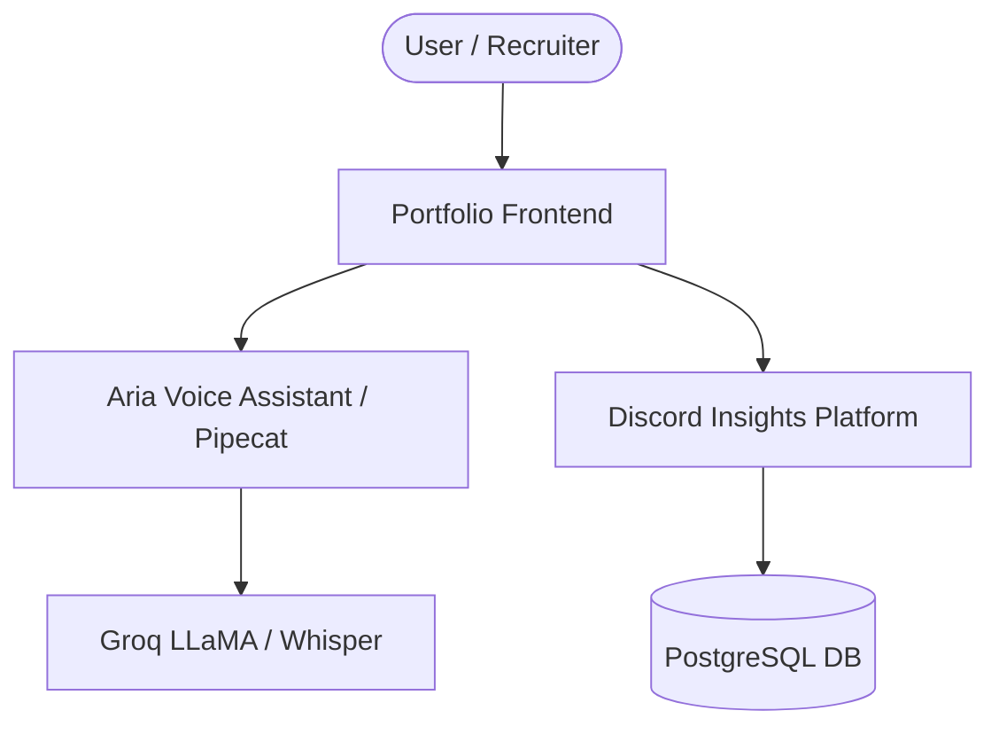

# 🏛️ Portfolio & AI Ecosystem Architecture

Overview of the system architecture, automated pipelines, and enterprise AI integrations powering the profile and portfolio.

## 🛠️ Core Components
- **Portfolio FE**: Web UI hosted on Firebase / Cloud Platform.
- **Discord Insights Platform**: Analytical engine with AST SQL validation & SSE.
- **Voice AI (Aria)**: Low-latency WebRTC conversational assistant.

## 🔄 Automated CI/CD & Engineering Quality Pipeline
- **Issues & PR Templates**: Standardized `.github` templates for bug tracking and feature pull requests.
- **Branch Protection & Review Protocol**: Requires issue linkage and code review verification before merging into `main`.
