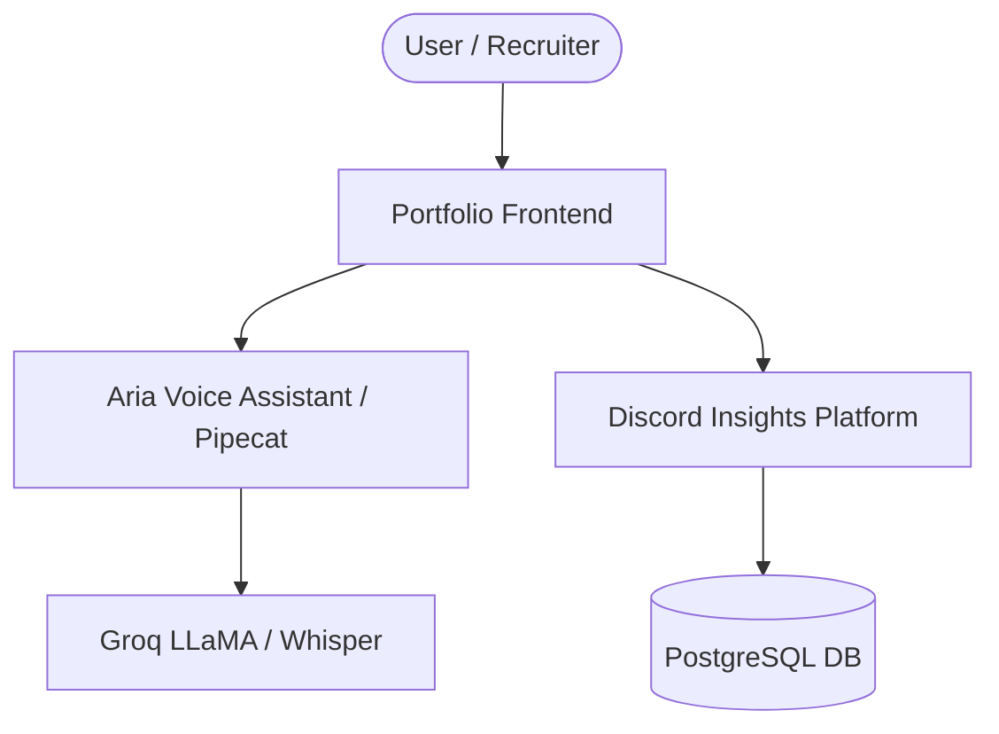

# 🏛️ Portfolio & AI Ecosystem Architecture

Overview of the system architecture, automated pipelines, and enterprise AI integrations powering the profile and portfolio.

```mermaid
graph TD
    User([User / Recruiter]) --> Web[Portfolio Frontend]
    Web --> VoiceAI[Aria Voice Assistant / Pipecat]
    Web --> Analytics[Discord Insights Platform]
    Analytics --> PostgreSQL[(PostgreSQL DB)]
    VoiceAI --> Groq[Groq LLaMA / Whisper]
```

## 🛠️ Core Components
- **Portfolio FE**: Web UI hosted on Firebase / Cloud Platform.
- **Discord Insights Platform**: Analytical engine with AST SQL validation & SSE.
- **Voice AI (Aria)**: Low-latency WebRTC conversational assistant.

## 🔄 Automated CI/CD & Engineering Quality Pipeline
- **Issues & PR Templates**: Standardized `.github` templates for bug tracking and feature pull requests.
- **Branch Protection & Review Protocol**: Requires issue linkage and code review verification before merging into `main`.
- **Contribution Snake** (`.github/workflows/snake.yml`): Daily GitHub Action that renders the contribution graph as a light + dark snake animation with `Platane/snk` and publishes it to the `output` branch.

## 🎨 Profile README Assets
- **Self-hosted SVGs** (`images/`): Hero terminal, impact strip, project cards, stack map and contact buttons are plain SVG with CSS/SMIL animation and no scripts, so the profile doesn't depend on third-party badge services.
- **Graceful degradation**: Where animation is unsupported, the terminal shows its full transcript and cards render static.
- **Assets as code** (`scripts/generate_assets.py`): All SVGs are generated from data in one script; edit the numbers, projects or terminal script and re-run `python3 scripts/generate_assets.py`.
