<p align="center">
  
</p>

<p align="center">
  <a href="https://portfolio-u-pavankumar.web.app"></a>&nbsp;
  <a href="https://linkedin.com/in/u-pavankumar"></a>&nbsp;
  <a href="mailto:pavan.aidev@gmail.com"></a>
</p>

<p align="center">
  
</p>

## ⚡ `whoami --verbose`

```python
class PavanKumar(AIEngineer):
    """I turn manual business queues into AI systems that run on their own."""

    role       = "AI Engineer @ Envision Beyond"
    experience = {
        "Envision Beyond":    "multi-tenant e-Invoicing (2,000+ docs/mo) · Graph API + Odoo CRM automation",
        "Spire Technologies": "Data Analyst Consultant · Python–SQL pipelines, 100K+ records",
    }
    builds     = ["AI agents", "real-time voice AI", "RAG", "enterprise ETL", "LLM failover"]
    education  = "B.E. Computer Science (Data Science) · MVJ College of Engineering · 2020–24"
    certified  = ["Google Data Analytics (Coursera)", "HackerRank: Python", "HackerRank: Problem Solving"]
```

## 🚀 Things I've built

<p align="center">
  <a href="https://github.com/UPavankumar/discord-insights"></a>
  <a href="https://portfolio-u-pavankumar.web.app"></a>
</p>
<p align="center">
  <a href="https://portfolio-u-pavankumar.web.app"></a>
  <a href="https://portfolio-u-pavankumar.web.app"></a>
</p>
<p align="center">
  <a href="https://github.com/UPavankumar/Portfolio_Assistant"></a>
  <a href="https://github.com/UPavankumar/Ecommerce-Churn-ML"></a>
</p>

## 🏗️ Under the hood — Discord Insights

An LLM that writes SQL is only useful if it can't hurt the database. Every answer goes through a failover chain of models and a validation layer before anything touches Postgres:

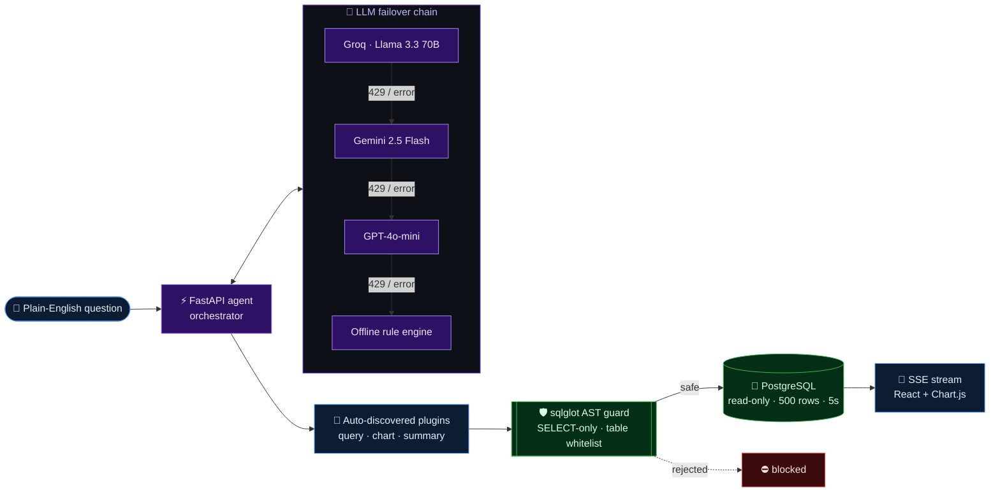

<details>
<summary><b>🎙️ How Aria's voice loop fits together</b></summary>
<br/>

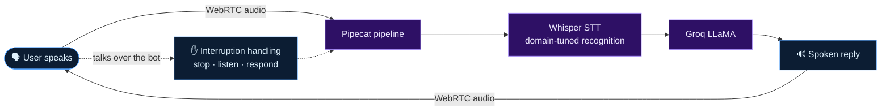

</details>

## 🧰 Stack

<p align="center">
  
</p>

## 📈 Activity

<p align="center">
  <picture>
    <source media="(prefers-color-scheme: dark)" srcset="https://raw.githubusercontent.com/UPavankumar/UPavankumar/output/github-snake-dark.svg"/>
    <source media="(prefers-color-scheme: light)" srcset="https://raw.githubusercontent.com/UPavankumar/UPavankumar/output/github-snake.svg"/>
    
  </picture>
</p>

<p align="center">
  <a href="https://git.io/streak-stats"></a>
</p>

---

<p align="center">
  <i>Building autonomous enterprise AI layers that run operations, eliminate manual queues, and scale under strict governance.</i>
  <br/><br/>
  
</p>
